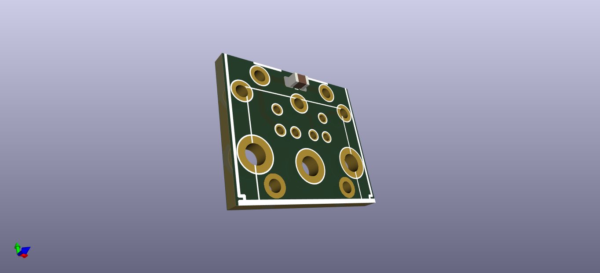

# PS2AT
This project makes up a small PCB that you can use to connect an older AT style motherboard with a newer (easier to find) PS/2 keyboard.

Solder some pins taken from a pin header to the bottom of the board that correspond with your motherboards original AT connector after you remove it.
Next solder on a standard PS/2 socket to the other space on the PCB. The surface mount footprint is for a 100nF capacitor if you feel the need.

CUT THE PINS SHORT AND ENSURE THAT NOTHING SHORTS OUT.
